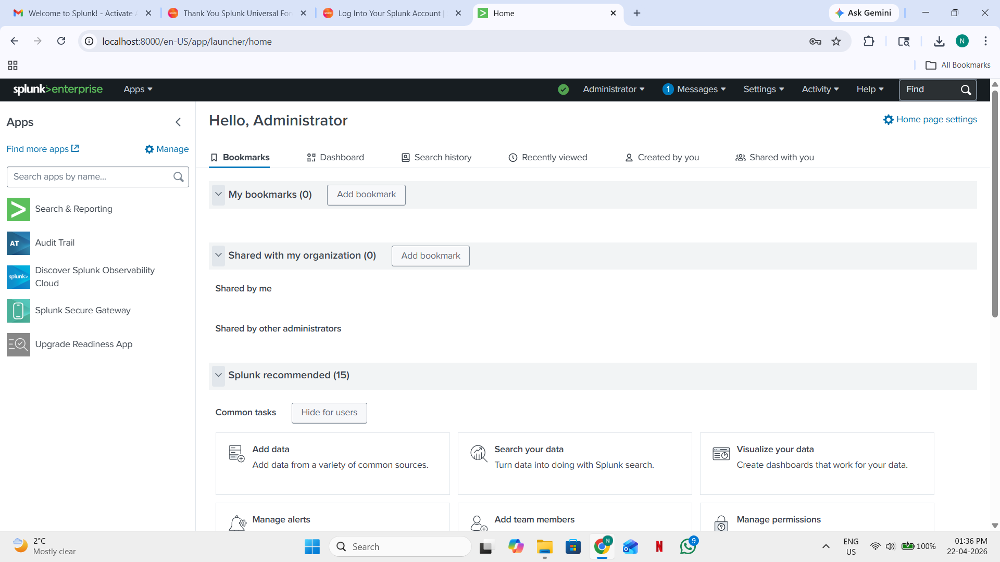
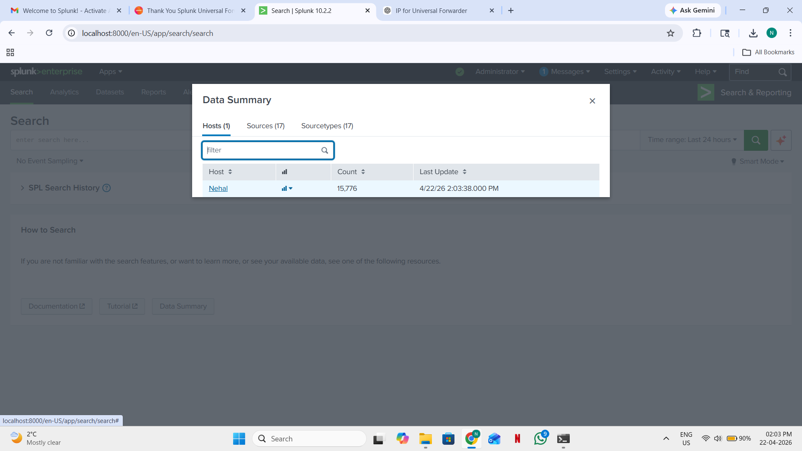
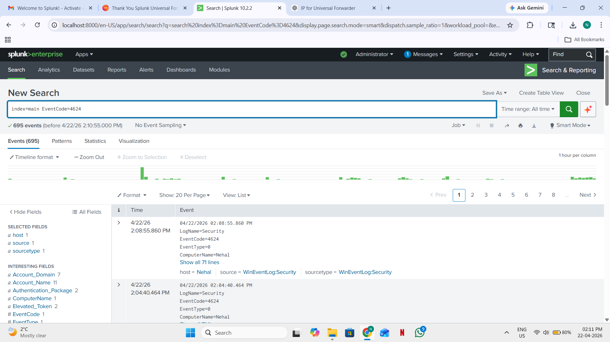
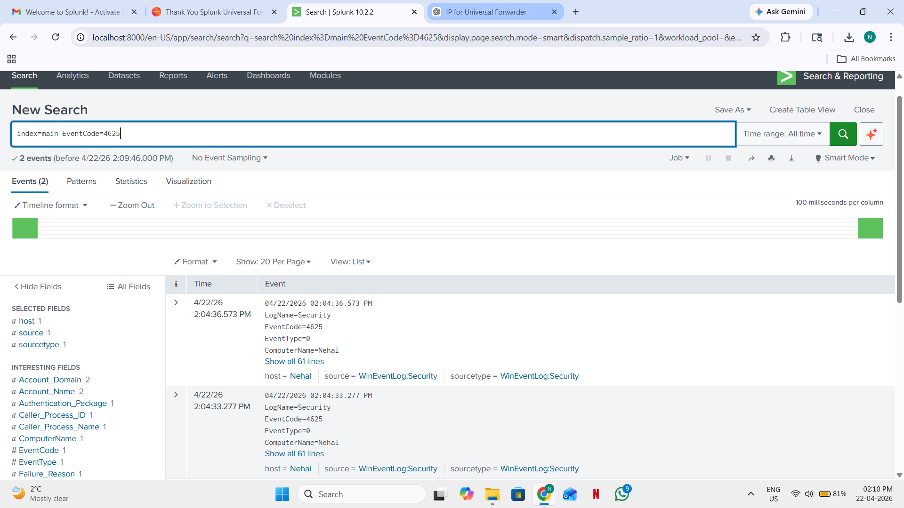
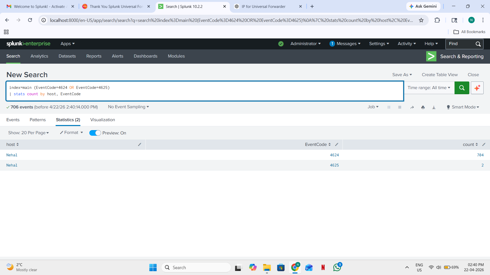
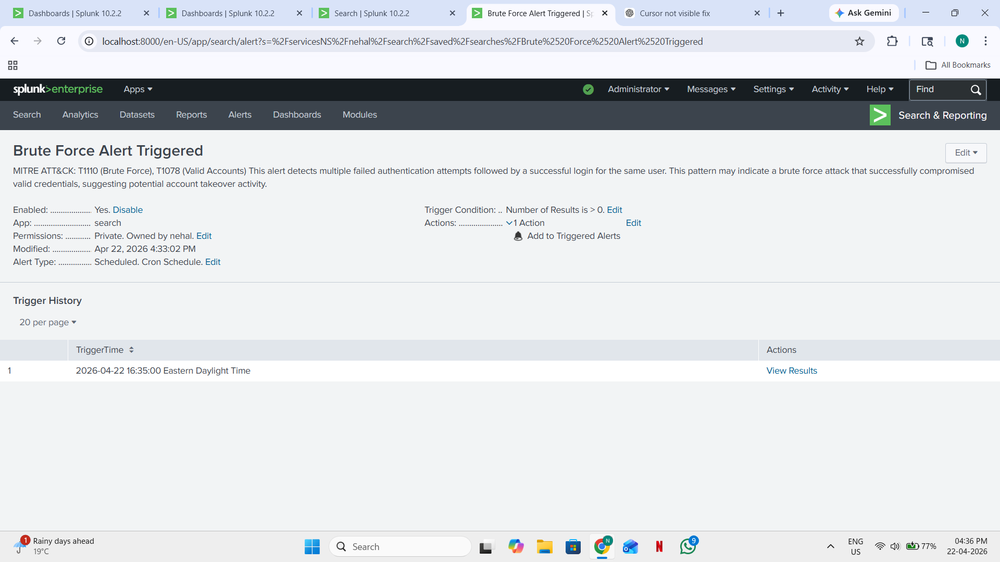
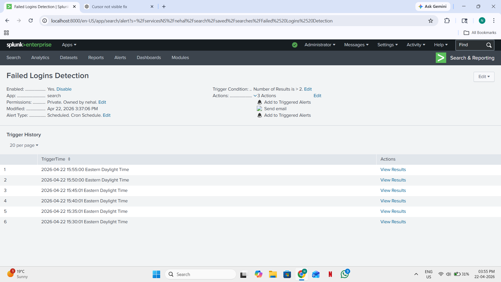
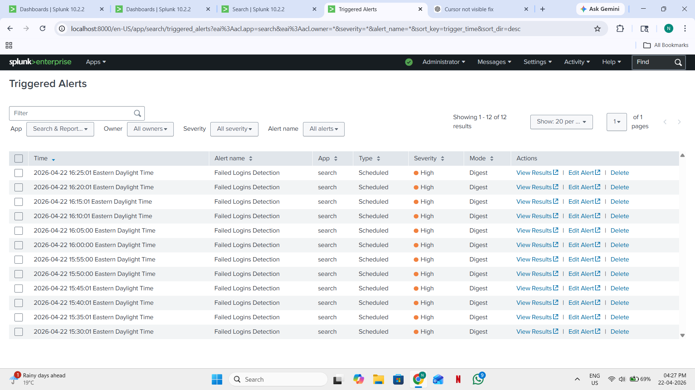
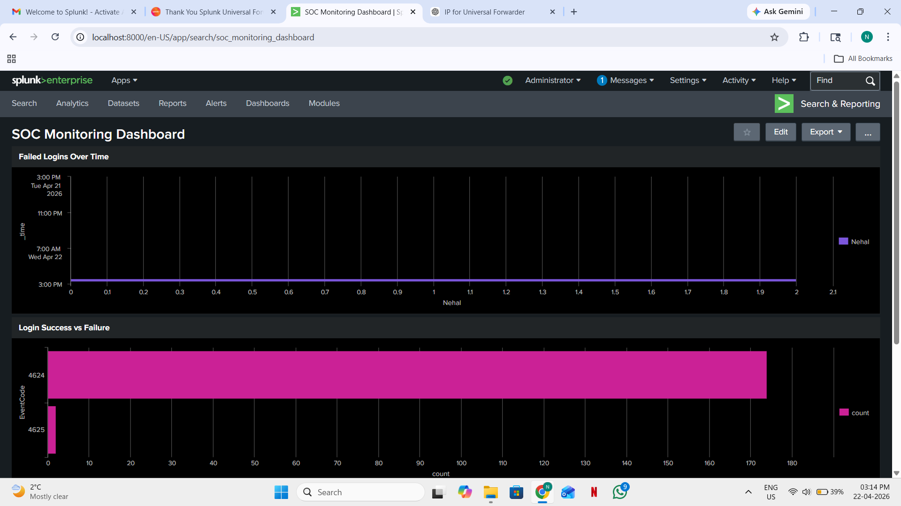
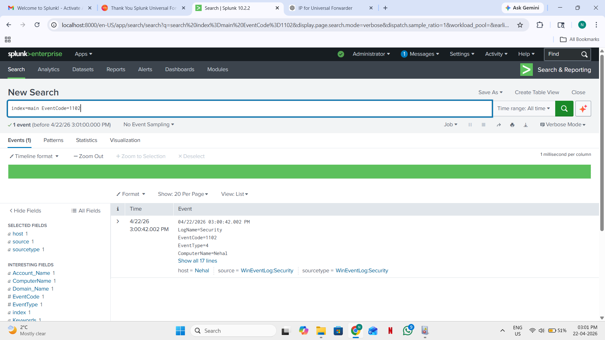

# SOC Brute Force Detection using Splunk

## 📌 Project Overview

This project demonstrates a Security Operations Center (SOC)-style detection system built in Splunk to identify brute force attacks followed by successful authentication attempts. It correlates Windows authentication logs to detect potential account compromise scenarios.

---

## 🧠 Attack Scenario

The detection focuses on the following pattern:

* Multiple failed login attempts (brute force / password guessing)
* Followed by a successful login for the same user

This may indicate:

* Credential stuffing
* Brute force attacks
* Account takeover

---

## 🛠️ Technology Stack

* Splunk Enterprise
* Windows Security Event Logs
* Splunk Universal Forwarder
* SPL (Search Processing Language)

---

## 🏗️ Project Workflow

Windows Machine → Splunk Forwarder → Splunk Index (main) → Correlation Search → Alert → Dashboard

---

Perfect—now I’ll align your **README image sections exactly to your real filenames** so everything renders correctly on GitHub.

Here is your **fixed README screenshots section (copy-paste ready):**

---

# 📸 SOC Brute Force Detection – Screenshots

---

## 🏠 Splunk Homepage

### Splunk Home Dashboard

**Description:**
Splunk homepage showing successful login to the Search & Reporting interface used for security monitoring and analysis.

---

## ⚙️ Forwarder Setup

### Splunk Universal Forwarder Configuration

**Description:**
Configuration of Splunk Universal Forwarder on a Windows endpoint to forward authentication logs to Splunk index for analysis.

---

## 📥 Windows Authentication Logs (4624)

### Successful Login Events (4624)

**Description:**
Windows Event ID 4624 showing successful authentication events used for correlation in brute force detection.

---

## ❌ Failed Login Events (4625)

### Failed Authentication Attempts (4625)

**Description:**
Windows Event ID 4625 showing failed login attempts used to detect brute force and password guessing activity.

---

## 📊 Event Count Analysis

### Authentication Event Count

**Description:**
Statistical breakdown of failed and successful login events used to identify suspicious authentication patterns.

---

## 🧠 Correlation Search / Alert Logic

### Brute Force Detection Query Result

**Description:**
SPL correlation output detecting multiple failed login attempts followed by successful authentication for the same user.

---

## 🚨 Alert Configuration

### Alert Creation in Splunk

**Description:**
Configuration of scheduled alert triggered when brute force conditions are met within the defined time window.

---

## 🚨 Alert Triggered

### Failed Login Alert Triggered

**Description:**
Splunk alert triggered after detection of repeated failed login attempts indicating potential brute force activity.

---

## 📊 Dashboard Overview

### SOC Brute Force Dashboard

**Description:**
Dashboard visualizing authentication trends including failed logins, successful logins, and suspicious activity patterns.

---

## 🧹 Log Tampering Event

### Windows Event Logs Deleted (1102)

**Description:**
Windows Security Event ID 1102 indicating security log deletion, often associated with malicious activity or forensic evasion attempts.

## 📈 Key Features

* Brute force detection
* Correlation of failed and successful logins
* Risk scoring model
* MITRE ATT&CK mapping
* SOC-style dashboard

---

## 🧠 Skills Demonstrated

* SIEM (Splunk) analysis
* Threat detection engineering
* SPL query development
* MITRE ATT&CK mapping
* Security monitoring & alerting

---

## 🚀 Future Improvements

* Geo-location anomaly detection
* Password spraying detection
* Lateral movement detection
* SOAR integration (ServiceNow/Jira simulation)

---

## 👤 Author

Nehal Patel
